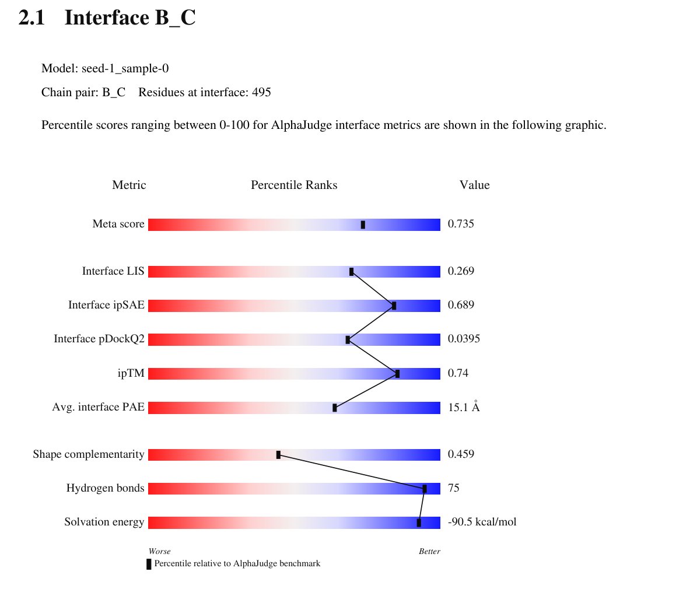

# AlphaJudge: I am the score!

AlphaJudge evaluates AlphaFold-predicted protein complexes by merging AI-derived confidences (ipTM, pTM, iptm+ptm/confidence_score, pLDDT, PAE) with fast, self-contained interface biophysics (contacts, H-bonds, salt bridges, buried area, solvation proxy, shape complementarity) into a tidy CSV for downstream analysis.


[](#citation-and-license)
[]()
[]()

---

## What it does

AlphaJudge parses AF2, AF3, and Boltz-2 outputs and summarizes per-model / per-interface metrics:

| category | metrics (examples) | notes |
| --- | --- | --- |
| **AlphaFold internal** | ipTM, pTM, iptm+ptm/confidence_score, avg interface PAE, avg interface pLDDT, contact probabilities | unified for AF2/AF3 where available |
| **physical & geometric** | buried area, contact pairs, H-bonds, salt bridges, interface composition, shape complementarity | self-contained |
| **derived scores** | pDockQ, pDockQ2, mpDockQ, ipSAE, LIS, cLIS, iLIS, interface score, contact-probability summaries | implemented here |

Use cases: rank poses, sanity-check AF confidences, or export features for ML.

---

## Pipeline overview

```
AlphaFold or Boltz models  →  AlphaJudge  →  interfaces.csv
```

- Detects AF2, AF3, and Boltz-2 automatically from the run directory
- Loads structure and confidences, computes interface descriptors
- Writes `interfaces.csv` into the same directory

---

## Installation

Create conda/mamba env, then install from pypi:

```bash
pip install alphajudge
```

If you are a developer, install from github:

```bash
git clone https://github.com/KosinskiLab/AlphaJudge.git
cd AlphaJudge
mamba env create -f environment.yaml
mamba activate alphajudge
```

Then, pip install in the existing environment

```bash
pip install .
```

or pip editable install in existing environment

```bash
pip install -e .
```
Requirements: Python ≥3.10; runtime deps are `biopython`, `numpy`, `scipy`, `matplotlib` (installed automatically with `pip install .`). Test extras (`pytest`, `pytest-cov`, `pytest-xdist`, `pytest-timeout`) are available via `pip install -e ".[test]"`.

---

## CLI usage

The package exposes an `alphajudge` entry point.

```bash
# Basic synopsis
alphajudge PATH [PATH ...] \
  --models_to_analyse {best,all} \
  --contact_thresh 8.0 \
  --pae_filter 100.0 \
  --ipsae_pae_cutoff 10.0 \
  [-r|--recursive] \
  [-o|--summary SUMMARY.csv] \
  [--cores] \
  [--report | --no-report] \
  [--aggregate_report AGGREGATE.pdf]
```

- **PATH**: One or more run directories or roots to search
- **--contact_thresh**: Contact cutoff in Å (default: 8.0)
- **--pae_filter**: Skip interfaces with avg interface PAE above this (default: 100.0)
- **--ipsae_pae_cutoff**: PAE cutoff used by ipSAE (default: 10.0)
- **--models_to_analyse**: `best` or `all` (default: best)
- **-r / --recursive**: Recursively discover runs under each PATH
- **-o / --summary**: Write an aggregated CSV across all processed runs
- **--cores**: Number of processes to use across run directories (0 = all available cores)
- **--report / --no-report**: Write an RCSB-style `report.pdf` next to each per-run `interfaces.csv`. Default is on for single-run scoring and off when `--summary` is used, so benchmark aggregations stay fast.
- **--aggregate_report AGGREGATE.pdf**: After scoring, build a multi-page validation PDF from the `--summary` CSV with one slider page per interface ranked by meta score, followed by a "Per-complex evidence" section with the per-complex confidence sliders and PAE heatmap for each top-N complex (requires `--summary`).

Outputs:
- Always writes `interfaces.csv` inside each processed run directory.
- For each processed model, also writes a PAE heatmap PNG `pae_<model>.png` next to `interfaces.csv`.
- If `--report` is on, also writes `report.pdf` next to `interfaces.csv` -- an RCSB-style validation report with a percentile slider panel for every detected interface and a final "Complex-level confidence & PAE" page combining the per-complex scalars (confidence score, pDockQ/mpDockQ) with the PAE heatmap.
- If `--summary` is provided, also writes a union-header CSV at the given path containing rows from all runs.
- If `--aggregate_report` is provided, also writes a multi-page PDF: cover with the meta-score histogram, summary statistics, and a top-N interfaces table; one slider page per interface across the whole cohort; then a "Per-complex evidence" section with one page per top-N complex (per-complex confidence sliders plus PAE heatmap).

Report generation is backend-agnostic: AF2, AF3, and Boltz-2 runs all flow through the same scoring path, so `--report` and `--aggregate_report` work identically for any mix of supported predictions in one cohort. Multimers contribute one slider page per detected chain pair; dimers contribute one.

A separate `alphajudge-report` console entry is also available; it dispatches to per-run mode when given a run directory and to aggregate mode when given a summary CSV:

```bash
alphajudge-report path/to/run_dir --out-pdf path/to/report.pdf
alphajudge-report path/to/summary.csv --out-pdf path/to/aggregate.pdf
```

### Example: interface sliders

Every interface gets a percentile **slider** panel that places each metric against the
AlphaJudge benchmark — red = worse, blue = better, the marker is the percentile and the
raw value is shown on the right. Below is the top-ranked interface (chain pair B_C) from
the nine-chain complex **8HHY** (AlphaFold 3), meta score 0.735:



The full `report.pdf` contains one such page per detected interface, followed by a
complex-level confidence & PAE summary page.

Examples

```bash
# Single AF2 run (directory contains ranking_debug.json, pae_*.json, and model files)
alphajudge test_data/af2/pos_dimers/Q13148+Q92900

# Single AF3 run (AlphaPulldown-style or official DeepMind AF3 output layout)
alphajudge test_data/af3/pos_dimers/Q13148+Q92900 --models_to_analyse all

# Boltz-2 prediction directory (for example out_dir/predictions/my_input)
alphajudge out_dir/predictions/my_input --models_to_analyse all

# Aggregate multiple runs into one summary
alphajudge test_data/af2/pos_dimers/Q13148+Q92900 \
           test_data/af3/pos_dimers/Q13148+Q92900 \
           -o interfaces_summary.csv

# Recursively discover runs under roots and write a combined summary
alphajudge test_data/af2/pos_dimers test_data/af3/pos_dimers -r -o interfaces_summary.csv

# Score a cohort (any mix of AF2 / AF3 / Boltz-2 run dirs) and emit a cohort-wide
# validation PDF with one slider page per detected interface
alphajudge test_data/af2/pos_dimers test_data/af3/pos_dimers -r \
  -o interfaces_summary.csv \
  --aggregate_report aggregate_report.pdf
```

---

## Programmatic use

Minimal example:

```python
from pathlib import Path
from alphajudge.parsers import pick_parser
from alphajudge.runner import process, process_many

run_dir = Path("test_data/af2/pos_dimers/Q13148+Q92900")
parser = pick_parser(run_dir)
print("Detected parser:", parser.name)  # "af2" or "af3"
process(str(run_dir), contact_thresh=8.0, pae_filter=100.0, models_to_analyse="best")
print("Wrote:", run_dir / "interfaces.csv")

# Multiple runs + optional recursion and summary
process_many(
    [str(run_dir), "test_data/af3/pos_dimers/Q13148+Q92900"],
    contact_thresh=8.0,
    pae_filter=100.0,
    models_to_analyse="best",
    recursive=False,
    summary_csv="interfaces_summary.csv",
)
```

Key outputs per interface include: `average_interface_pae`, `interface_average_plddt`, `interface_contact_pairs`, `interface_contact_prob_max`, `interface_contact_prob_top10_mean`, `interface_area`, `interface_hb`, `interface_sb`, `interface_sc`, `interface_solv_en`, `interface_ipSAE`, `interface_LIS`, `interface_cLIS`, `interface_iLIS`, `interface_pDockQ2`, and per-run `pDockQ/mpDockQ`.

---

## Expected input layout

AlphaJudge expects standard prediction run outputs.

- AF2: directory with `ranking_debug.json`, `pae_<model>.json`, and model structure files (`model.cif` or `*.pdb/*.cif`)
- AF3: AlphaPulldown/normalized layout with `ranking_scores.csv` and per-model `summary_confidences.json`/`confidences.json`, or official DeepMind AF3 layout with `<job_name>_ranking_scores.csv` and prefixed per-sample files such as `<job_name>_seed-<seed>_sample-<sample>_model.cif`
- Boltz-2: prediction directory with ranked files such as `<input>_model_0.cif`, `confidence_<input>_model_0.json`, and optional `pae_<input>_model_0.npz` / `plddt_<input>_model_0.npz`

The tool searches for `model.cif` inside each model subdirectory first; otherwise it tries to match `*<model>*.cif` or `*<model>*.pdb` at the run root. AlphaJudge currently scores protein and nucleic-acid interfaces; ligands present in AF3 or Boltz-2 structures are ignored for interface construction. When confidence arrays include ligand tokens, supported parsers align or trim them to the scored protein/nucleic-acid residue block.

---

## Output schema (CSV)

AlphaJudge writes `interfaces.csv` with one row per interface (and includes the selected model). Core fields include:

- **jobs**: run directory name
- **model_used**: selected model identifier
- **interface**: chain-pair label (e.g., `A_B`)
- **iptm_ptm, iptm, ptm, confidence_score**: unified AF confidences
- **pDockQ/mpDockQ**: global dockQ-like score (mpDockQ if multimer; pDockQ if dimer)
- **average_interface_pae, interface_average_plddt, interface_num_intf_residues**
- **interface_contact_pairs, interface_score, interface_pDockQ2, interface_ipSAE, interface_LIS, interface_cLIS, interface_iLIS**
- **interface_contact_prob_source, interface_contact_prob_max, interface_contact_prob_top10_mean**: AF3 native `contact_probs`, or Humphreys-style AF2 distogram-derived contact probability (`d < 12 A`) when full result pickles retain the `distogram` key. If AF2 result pickles do not contain `distogram` (for example because AlphaPulldown removed it with `--remove_keys_from_pickles`), these columns are empty/NaN and AlphaJudge logs a warning.
- **interface_hb, interface_sb, interface_sc, interface_area, interface_solv_en**

Exact header is asserted in tests to be consistent across AF2 and AF3 runs.

---

## Testing

```bash
pip install -e ".[test]"
pytest -q
```

Tests exercise AF2, AF3, and Boltz-2 parsers and validate the CSV fields against bundled fixtures in `test_data/`. The slow CCP4 SC regression suite is opt-in and can be enabled with `ALPHAJUDGE_RUN_SLOW_SC_REFERENCE=1`; CI always runs it across Python 3.10–3.13.

---

## Docker

A minimal multi-stage Dockerfile is provided under `docker/`:

```bash
# Build image (runs tests in the build stage)
docker build -t alphajudge -f docker/Dockerfile .

# Inspect CLI inside the runtime image
docker run --rm alphajudge alphajudge --help
```

---

## Citation and license

Please cite:

> AlphaJudge: we will come up with a better name. (xxxx).
> `https://github.com/KosinskiLab/AlphaJudge`

License: MIT for this repository. AlphaFold2/AlphaFold3, and other tools remain under their own licenses.

---
